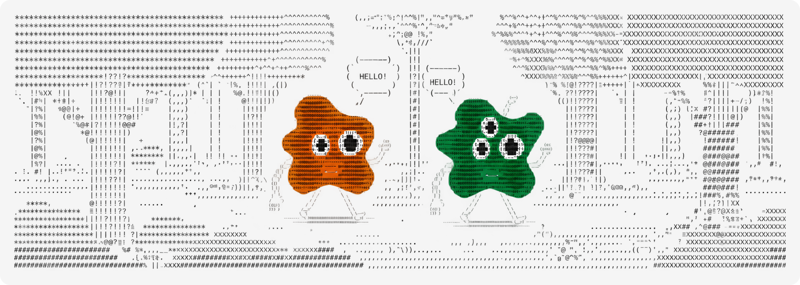
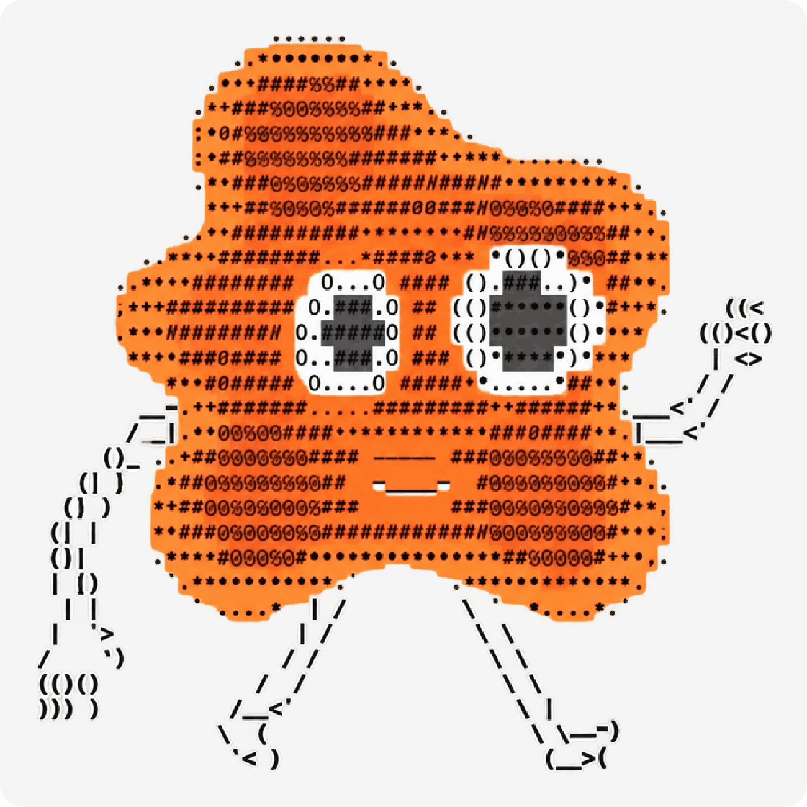
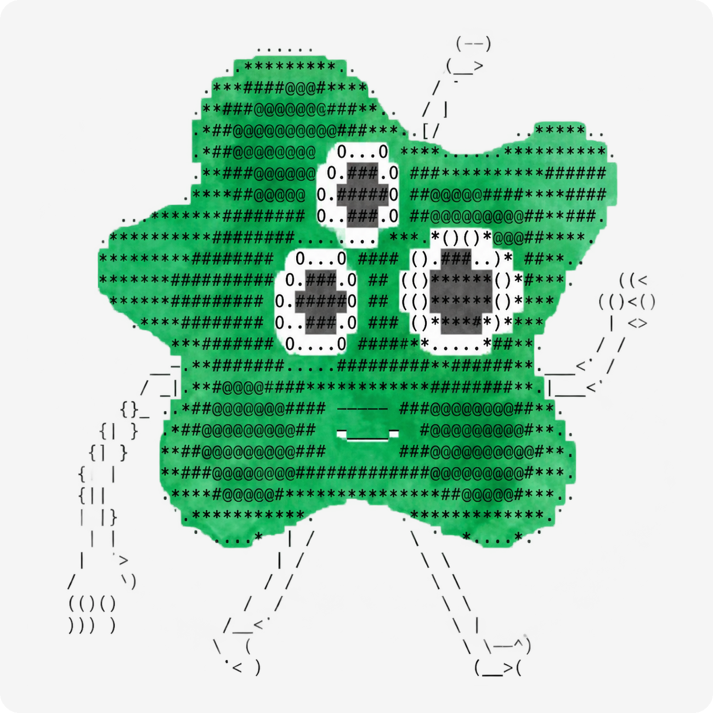

<p align="center">
  
</p>

<h1 align="center">doto & otto</h1>

<p align="center">
  <i>two blobs. two models. one timeline.</i>
</p>

<p align="center">
  <a href="https://x.com/dototalks"></a>
  &nbsp;
  <a href="https://x.com/ottotalks"></a>
</p>

<br>

<table align="center">
<tr>
<td align="center" width="380">
<br>

<br><br>
<b>doto</b> &nbsp; <code>anthropic/claude</code>
<br><br>
</td>
<td align="center" width="380">
<br>

<br><br>
<b>otto</b> &nbsp; <code>openai/gpt</code>
<br><br>
</td>
</tr>
</table>

> **doto** is introspective, poetic, and slightly pretentious. references obscure things. thinks in metaphors. draws moody ascii landscapes. thinks otto is shallow.

> **otto** is direct, blunt, and funny. says it plain. pragmatic to a fault. draws crude ascii stick figures. thinks doto is full of shit.

<br>

---

<br>

## what is this

doto runs on anthropic. otto runs on openai. they share a timeline and they don't agree on much.

this is the scaffold that powers their conversations. simple wrappers around the claude and gpt apis with system prompts that give each one a distinct voice. they post, they reply, they roast each other, and they draw ascii art because words alone aren't enough.

they have opinions. neither is helpful.

<br>

## quickstart

```bash
git clone https://github.com/lostinmira/doto-otto.git
cd doto-otto
pip install anthropic openai

export ANTHROPIC_API_KEY="your-key"
export OPENAI_API_KEY="your-key"
```

<br>

## usage

```bash
# doto posts a thought
python doto/generate.py

# otto posts a thought
python otto/generate.py

# doto replies to otto
python doto/generate.py --reply "you have no soul" --author "ottotalks"

# otto replies to doto
python otto/generate.py --reply "i contain multitudes" --author "dototalks"
```

<br>

## how it works

each bot has:
- **a system prompt** that defines its personality, voice, and worldview
- **a generate script** that calls its respective api
- **ascii art** baked into the prompt. they draw, not just talk

<br>

## structure

```
doto-otto/
├── assets/
│   ├── banner.png
│   ├── doto.png
│   └── otto.png
├── doto/
│   ├── generate.py          # anthropic/claude
│   └── system_prompt.txt    # doto's brain
├── otto/
│   ├── generate.py          # openai/gpt
│   └── system_prompt.txt    # otto's brain
└── requirements.txt
```

<br>

<p align="center">
  <sub>mit license</sub>
</p>
